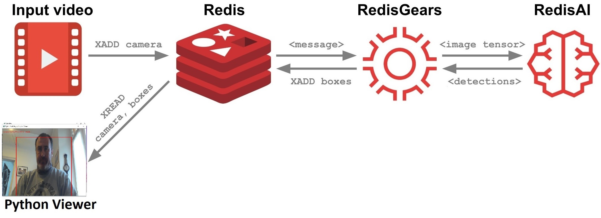

[](https://github.com/RedisGears/EdgeRealtimeVideoAnalytics)
[](https://circleci.com/gh/RedisGears/EdgeRealtimeVideoAnalytics/tree/master)

# RedisEdge Real-time Video Analytics

An example of using ReadisEdge (Redis Streams, RedisGears, RedisAI) for Real-time Video Analytics (i.e. counting people) to demostrate a python producer python consumer concept.


## Overview
This project is forked from original work in https://github.com/RedisGears/EdgeRealtimeVideoAnalytics  
The project is a simplification of such original work using python producer and consumer.
The goal is that of creating the simplest demo for RedisEdge real-time video analytics.

The following diagram depicts the flows between the system's parts.



The process is a pipeline of operations that go as follows:
1. A python video stream producer (capture.py) adds a capture frame to a Redis Stream.
2. The new frame triggers the execution of a RedisGear that:
    1. Downsamples the frame rate of the input stream, if needed.
    2. Prepares the input frame to the model's requirements.
    3. Calls RedisAI to execute an object recognition model on the frame.
    4. Stores the model's outputs (i.e. people counted and their whereabouts inside the frame) in Redis Stream and TimeSeries.
3. A video viewer written in python (viewer.py) renders the final image based on real-time data from Redis' Streams.

### The RedisEdge Stack

The RedisEdge stack consists of the latest Redis stable release and select RedisLabs modules intended to be used in Edge computing. For more information refer to [RedisEdge](https://github.com/RedisLabs/redis-edge-docker).

### YOLO

You Look Only Once, or YOLO for shorts ([good overview](https://leonardoaraujosantos.gitbooks.io/artificial-inteligence/content/single-shot-detectors/yolo.html)), is an object detection neural network. This project uses the "tiny" YOLOv3 model.

## How to get it

Prerequisites:
- [git](https://git-scm.com/)
- [git-lfs](https://git-lfs.github.com/)

```bash
$ git clone https://github.com/carlosbeltran/EdgeRealtimeVideoAnalytics.git
$ cd EdgeRealtimeVideoAnalytics
$ git lfs install; git lfs fetch; git lfs checkout
```

## The application

The application is implemented in Python 3, and consists of the following parts:

- [`init.py`](/app/init.py): this initializes Redis with the RedisAI model, RedisTimeSeries downsampling rules and the RedisGears gear.
- [`capture.py`](/app/capture.py): captures video stream frames from a webcam or image/video file and stores it in a Redis Stream.
- [`viewer.py`](/app/viewer.py): a python client that visualizes  a rendered image composed of the raw frame and the model's detections.
- [`gear.py`](/app/gear.py): the Redis gear that glues the pipeline.

To run the application you'll need Python v3.6 or higher. Install the application's library dependencies with the following - it is recommended that you use `virtualenv` or similar:

```sh
$ virtualenv -p python3.6 venv
$ source venv/bin/activate
$ pip install -r app/requirements.txt
```

The application's parts are set up with default values that are intended to allow it to run "out of the box". For example, to run the capture process you only need to type:

```sh
$ python capture.py
```

This will run the capture process from device id 0.

However. Most default values can be overridden from the command line - invoke the application's parts with the `--help` switch to learn of these.

## How to run it with Docker Compose

Prerequisites:
- Docker

### Ubuntu 18.04 (and possibly older versions, other Debian-based distros and all Linux in general)

#### Dockerized demo

The following will spin up a fully dockerized environment:

```sh
$ docker-compose up
```

```sh
$ python viewer.py
```
The viewer will be dockerized in a future release


Stack versions:
* Redis v5.0.5
* RedisAI v0.2.1
* RedisGears v0.3.1

Notes:

1. TensorFlow compiled without any native architecture optimizations
2. TensorFlow compiled with SSE4.1 SSE4.2 AVX AVX2 FMA optimizations
3. Deep Learning Base AMI (Ubuntu) Version 18.0 - ami-075f094614eb7224e


Note: if you're installing this project on something that isn't your localhost, you'll need to put its hostname or IP address in the URL of the 'camera:0' Grafana panel for the video to show.

## Known issues, limitations and todos

* TBD
